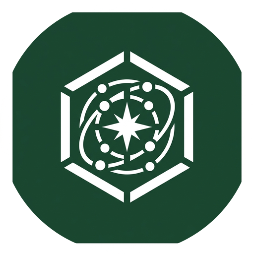

  
  <h1>OpenSpace CRM</h1>
  
<strong>The Next-Generation AI-Powered Workspace & CRM</strong>

---

## 🌟 Overview

**OpenSpace** is a premium, enterprise-grade Customer Relationship Management (CRM) platform designed for modern businesses. Built with a stunning frosted-glass aesthetic, OpenSpace integrates deep operational tools with state-of-the-art AI to streamline your workflow, manage clients, and automate daily tasks.

Whether you are a product-based business managing inventory or a service-based agency tracking projects, OpenSpace adapts to your operational needs seamlessly.

## ✨ Key Features

- 🏢 **Dynamic Workspaces**: Tailored modules based on your business type (Hybrid, Product, or Service).
- 🎨 **Premium UI/UX**: Built with a sleek, responsive "frosted glass" (glassmorphism) design system and mesh gradients.
- 🤖 **OpenSpace Intelligence**: An integrated floating AI chatbot and a dedicated RAG (Retrieval-Augmented Generation) microservice for semantic data search and insights.
- 📦 **End-to-End Management**: Modules for Clients, Products, Services, Projects, Invoices, Inventory, and Team management.
- 🔐 **Robust Architecture**: A robust full-stack architecture featuring Next.js (App Router), an Express.js backend API, and a dedicated Python FastAPI RAG Engine.

---

## 🏗️ Architecture

The OpenSpace ecosystem is divided into three primary services:

1. **Frontend (Next.js)**: The core UI client (`/src`), built with React, Tailwind CSS, Zustand (state management), and Lucide Icons.
2. **Backend API (Node.js)**: Located in `/backend`, handling robust authentication flows and database interactions.
3. **RAG Service (Python)**: Located in `/rag-service`, a dedicated microservice architecture designed for processing documents, managing vector stores, and serving AI query responses.
